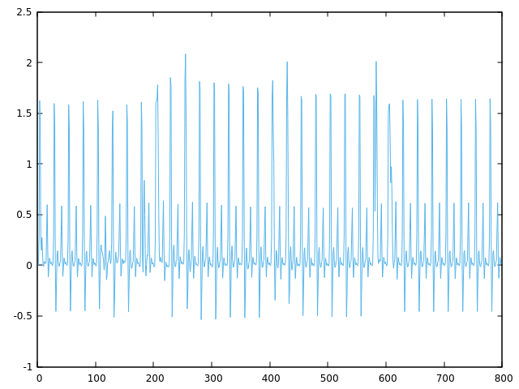
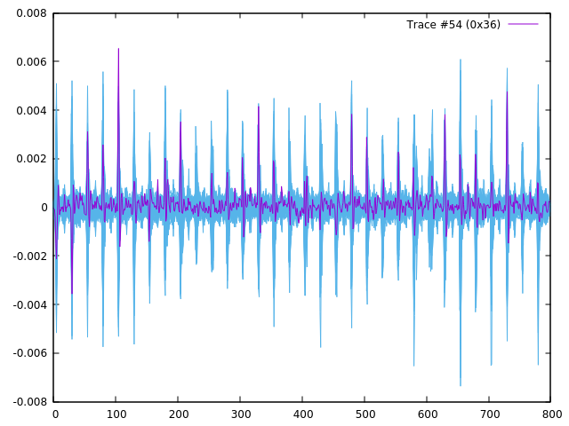
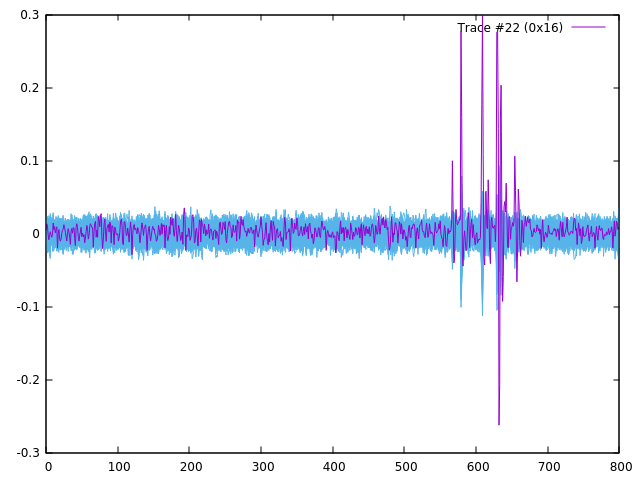

# Differential Power Analysis

## Example attack program

The following picture represents the average power trace obtained by running the standard version of `pa`.

As the high spikes represent a clock tick it is evident that the average trace includes 32 clock periods. The DES encipherment begins after the 8th tick, as the trace clearly shows an additional spike after the 8th tick, which, in my opinion, is due to the fact that that the LR and CD registers have been enabled and hence that there is a non standard additional power consumption due to switching activity. The encryption ends at the 16th clock tick, which is noticeable due to yet another spike in the waveform, representing the IO register being enabled once more to store the output cipher. All these information are consistent with the way the cryptoprocessor works, as it takes 8 clock cycles to store the input data and 16 clock cycles to produce the ciphertext.

Running the application without a 3rd argument (or 4th, according to argc) the targeted bit is set by default to the first one. The corresponding S-Box, according to the program, is the 4th one. This is correct as the first bit of the cipher function comes from the 16th bit of the S-boxes output, as shown by the permutation table (check the [DES standard pdf](../doc/des.pdf), page 13, or simply refer to the permutation table hardcoded inside `pa.c`). The 16th bit, in turn, clearly corresponds to the 4th S-box, as each S-box outputs 4 bits.

The maximum height, compared to the average waveform, is very small: 6.54e-03 versus 1.62 ca., which is the value of the averaged waveform around the 105th sample. This is normal, considering that the maximum value for correlation is 1, however this shows nonetheless that the maximum correlation found is very low. Concerning the index of the maximum, it is expected to appear around the 24th clock tick, as the correlation is performed between the overall power trace and the data computed at the end of the DES cycle. However, this is not the case, as the maximum is found at the 105th sample. This namely corresponds to the 105/25+1=4th clock cycle, the +1 having been added since the waveform basically commences from the first clock cycle. This seems suspicious as it seems that some sort of correlation has been found between the power trace and something occurring around the 5th clock tick, which shouldn't be the case, as the data we employed to compute the correlation is generated at the 16th clock cycle.

The following table summarizes the value which have been output by the standard `pa` program.

|Key bits|Best guess|L target bit|Max amplitude(x1000)|Max position|
|--------|----------|------------|--------------------|------------|
|1-6     |    010100|           9|                9.79|         155|
|1-6    |   111100|          17|               6.61|         610|
|1-6    |   101101|          23|               7.04|         705|
|1-6    |   111100|          31|               10.82|         555|
|7-12    |    011000|           2|                6.55|         730|
|7-12    |   010101|          13|               7.12|         630|
|7-12    |   001011|          18|               10.38|         555|
|7-12    |   001011|          28|               9.02|         555|
|13-18   |    110101|           6|                7.74|         630|
|13-18   |   000101|          16|               6.70|         655|
|13-18   |   011100|          24|               7.58|         105|
|13-18   |   001111|          30|               6.89|         55|
|19-24   |    110110|           1|                6.54|         105|
|19-24   |    011011|          10|                7.10|         755|
|19-24   |   010011|          20|               7.86|         630|
|19-24   |   001101|          26|               6.72|         30|
|25-30   |    010111|           3|                6.58|         680|
|25-30   |    101101|           8|                9.91|         130|
|25-30   |   110010|          14|               6.81|         130|
|25-30   |   010110|          25|               8.42|         555|
|31-36   |    011001|           4|                6.86|         680|
|31-36   |    011010|          11|                6.53|           5|
|31-36   |   001111|          19|               5.90|         205|
|31-36   |   000010|          29|               8.32|         55|
|37-42   |    110001|           7|                6.53|         730|
|37-42   |    010000|          12|                10.1|         556|
|37-42   |   010000|          22|               7.03|         556|
|37-42   |   110111|          32|               6.31|         130|
|43-48   |    001110|           5|                6.29|          30|
|43-48   |   101101|          15|               7.08|         5|
|43-48   |   001100|          21|               8.18|         130|
|43-48   |   000111|          27|               9.04|         655|

According to these results, and to the dpa plot, it is clear that the output key is not the correct one. First of all, the 4 best guesses of the 4th S-box differ with respect to each other. Secondly, as previously stated, it is at least odd to find such a degree of correlation around the 5th clock tick since we're correlating according to something happening at the 16th clock cycle. This attack is clearly inefficient. It uses the Hamming weight of the inspected bit to produce a result, but, as we have seen in class, this is less efficient than the Hamming distance between bits when it comes to power analysis since the effects of the short circuit current contribute to better highlight the occurrence of a transition with respect to no transition at all.

## Attack phase

The attack examined until now might as well work given a larger amount of samples. However, since they are not available, it is necessary to resort to a different strategy, such as putting into place a hamming distance attack. In order to do so, the targeted, _key dependent_ data is compared with the value it will assume in the following clock cycle.

The data in question switches from the content of the L15 block to the content of the L16 block, considering the notation of the DES algorithm. This switching will surely occur in the red wire that loops back to the leftmost input of the MUX, shown in the DES crypto-processor [architecture](images/des_architecture.png). Depending on how we look at it we can say that the switching will occur in the rightmost 32 bits of the red wire or in the leftmost 32 bits of the left MUX input, since the 32 MSBs of the wire switch places with the 32 LSBs before entering the MUX.

The switching causes a more or less noticeable power consumption based on the number of bits that flip, i.e. based on the hamming distance between the old value (block L15) and the new value (block L16). It is worth remembering that the content of these blocks can be retrieved by using the facilities offered by the des library, starting from the ciphertext. Obviously, as in the starting version, the L15 block needs also a guess on the last round key before it can be computed.

An initial version, employing a single bit check without using the tr\_pcc library, was written and tested. Although it passed the pipeline check, it was evident that it did so mostly due to luck. In fact, by using one bit at a time, each S-box ended up having 4 best choices to pick from. However, the initial version didn't include a method to select the most reliable choice out of the 4 best ones and an arbitrary one would being chosen instead.

To solve this issue the tr\_pcc library was employed in order to be able to use the Pearson correlation coefficient to make hypothesis on 6 bits at a time and mount a Hamming distance attack, better suited when it comes to power analysis. Notice that the bits of L15 and L16 have been "unscrambled" via the function _des\_n\_p_ to consider the bits coming from the proper S-box under attack, as the P stage at the end of the cipher function f permutates the bits coming from the S-boxes. The attack was tested and proved successful. Its [code](pa.c) can be used as a reference in order to understand how the attack was implemented and how the tr\_pcc and the traces libraries were employed. It is interesting to notice that the produced correlation traces have a much higher maximum with respect to the original version. Moreover, the index of the maximum is always close to 581, which is where the 24th clock tick occurs and therefore where it makes more sense to find a higher correlation.

The following picture shows the DPA trace for the 4th S-box in the improved version.

